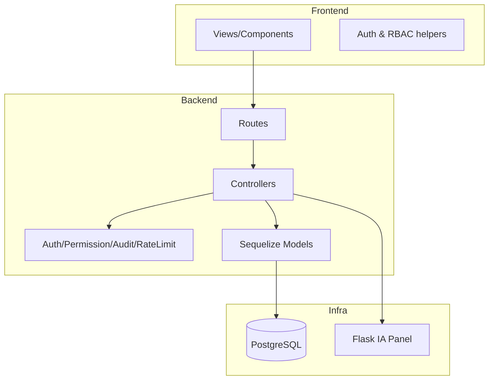
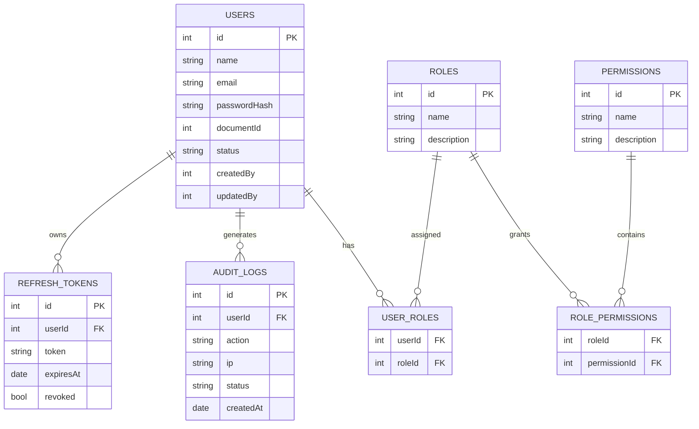

# 📘 Paquete de Evidencia – Memoria Técnica

**Proyecto:** UARP-IA (Propuesta de Trabajo de Grado)  
**Fecha:** 2026‑02‑04  
**Repositorio:** cristianbedoya64/crud-users-ia  

---

## 1) Contexto y problema
Las organizaciones requieren una plataforma segura y auditable para administrar usuarios, roles y permisos, con trazabilidad completa y soporte operativo. En el registro de usuarios, el riesgo de identidades sintéticas exige capas predictivas que complementen el control de acceso tradicional.

**Problema principal:** optimizar la seguridad en el registro de usuarios mediante un sistema RBAC con trazabilidad y un microservicio de scoring de riesgo con IA (Random Forest) como capa preventiva.

---

## 2) Requisitos

### 2.1 Funcionales
- **RF1:** Autenticación y autorización con JWT y RBAC.
- **RF2:** CRUD de usuarios, roles y permisos.
- **RF3:** Registro de auditoría de eventos y accesos fallidos.
- **RF4:** Panel IA con acceso restringido por permisos (PoC).
- **RF5:** Endpoints de salud y readiness para operación.
- **RF6:** Semillas y migraciones controladas por modo.
- **RF7:** Microservicio de scoring de riesgo (fase de grado) integrado al backend.

### 2.2 No funcionales
- **RNF1:** Seguridad por diseño (hash de contraseñas, mínimo privilegio, rate‑limit).
- **RNF2:** Auditabilidad (trazabilidad de acciones y fallos).
- **RNF3:** Reproducibilidad (scripts de arranque, documentación de despliegue).
- **RNF4:** Escalabilidad básica y rendimiento razonable (caching de permisos con TTL).
- **RNF5:** Compatibilidad local y Codespaces.
- **RNF6:** Capacidad de evaluación experimental del scoring (métricas y dataset controlado).

---

## 3) Arquitectura (diagramas + justificación)

### 3.1 Diagrama de alto nivel
```mermaid
flowchart LR
  FE[Frontend (Vite + React/Mantine)] -->|JWT| BE[Backend (Node.js/Express)]
  BE --> DB[(PostgreSQL)]
  BE --> IA[IA Panel (Flask, PoC)]
  BE --> RS[Risk Scoring (FastAPI, Random Forest)]
```

**Justificación tecnológica:**
- **React + Vite:** UI moderna, rápida, con componentes Mantine y control de permisos.
- **Node.js/Express:** API REST robusta, compatible con JWT y middleware de seguridad.
- **PostgreSQL + Sequelize:** modelo relacional con migraciones y control de esquema.
- **Flask IA Panel:** servicio aislado para funcionalidades IA de PoC, protegido por permisos.
- **FastAPI Risk Scoring:** microservicio proyectado para scoring de riesgo con Random Forest.
  - Especificacion tecnica: [risk_scoring_microservice.md](risk_scoring_microservice.md).
- **Docker Compose:** reproducibilidad y despliegue consistente.

### 3.2 Diagrama de componentes


---

## 4) Modelo de datos (ER + tablas + relaciones)

### 4.1 Diagrama ER (resumen)


### 4.2 Tablas y relaciones clave
- **Users ↔ Roles:** relación N‑N vía `UserRole`.
- **Roles ↔ Permissions:** relación N‑N vía `RolePermission`.
- **Users ↔ AuditLog:** 1‑N para auditoría.
- **Users ↔ RefreshToken:** 1‑N para sesiones.

---

## 5) Seguridad (amenazas y mitigaciones)

### Amenazas principales
- Exposición de contraseñas.
- Escalada de privilegios.
- Acceso no autorizado al panel IA.
- Abuso por fuerza bruta o flooding.
- Pérdida de trazabilidad.

### Mitigaciones implementadas
- **Hashing de contraseñas** (nunca exposición en API).
- **RBAC estricto** para endpoints y UI.
- **Panel IA protegido** por permisos.
- **Rate limiting** y logging de accesos fallidos.
- **Audit logging** con userId=0 si no autenticado.

---

## 6) Pruebas (qué, cómo, evidencia)

### Qué se prueba
- Seguridad (no exposición de contraseñas).
- Control de permisos (403 en accesos no autorizados).
- Flujo de refresh tokens (rotación y revocación).
- Matriz de permisos.

### Cómo se ejecuta
- Backend: pruebas con Jest/Supertest.
- Frontend: validación manual y checklist de QA.
- Lighthouse: medición reproducible documentada.

### Evidencia
- Reportes de prueba: ver documentación en `backend/README.md` y `docs/lighthouse.md`.

---

## 7) Despliegue y operación

### Variables y modos
- `RUN_MODE=local|prod-demo` (comportamiento del arranque).
- `MIGRATE_MODE` para controlar migraciones.
- `SEED_MODE` y `SEED_ALLOW_SYNC` para control de datos semilla.

### Scripts operativos
- `scripts/start.sh`: arranque reproducible con waits, migraciones y seed por modo.

### Backup/restore
- Documentado en `docs/RESTORE_BACKUP.md`.

---

## 8) Limitaciones y trabajo futuro
- **Limitaciones actuales**
  - Escalamiento horizontal no automatizado.
  - Faltan pruebas E2E completas.
  - UI de auditoría puede enriquecerse con filtros avanzados.

 - **Trabajo futuro**
  - Microservicio de scoring de riesgo con IA (Random Forest) y validación de identidades sintéticas.
  - Observabilidad avanzada (tracing/metrics).
  - Automatización CI/CD completa.
  - Política de retención de auditoría.

---

## 9) Matriz de trazabilidad (Requisito → Endpoint/UI → Tabla → Evidencia)

| Requisito | Endpoint/UI | Tabla(s) | Evidencia |
|---|---|---|---|
| RF1 Autenticación | `/api/auth/login`, `/api/auth/refresh` | `users`, `refresh_tokens` | `backend/tests/api.test.js` |
| RF2 CRUD usuarios | UI Usuarios / `/api/users` | `users` | `docs/api.md` |
| RF2 CRUD roles | UI Roles / `/api/roles` | `roles`, `user_roles` | `docs/api.md` |
| RF2 CRUD permisos | UI Permisos / `/api/permissions` | `permissions`, `role_permissions` | `docs/api.md` |
| RF3 Auditoría | UI Auditoría / `/api/audit` | `audit_logs` | `docs/security.md` |
| RF4 Panel IA | UI IA / `/api/ia/*` | `audit_logs` | `docs/ai_assistance.md` |
| RF5 Health/Ready | `/health`, `/ready` | N/A | `docs/DEPLOY.md` |
| RF6 Seed/Migrate | `scripts/start.sh`, `backend/src/migrate.js`, `backend/src/seed.js` | N/A | `docs/db.md` |

---

## 10) Referencias internas (base existente)
- `docs/api.md`
- `docs/db.md`
- `docs/security.md`
- `docs/DEPLOY.md`
- `docs/RESTORE_BACKUP.md`
- `docs/CHANGELOG.md`
- `docs/lighthouse.md`
- `docs/ai_assistance.md`
- `docs/ai_traceability/README.md`
